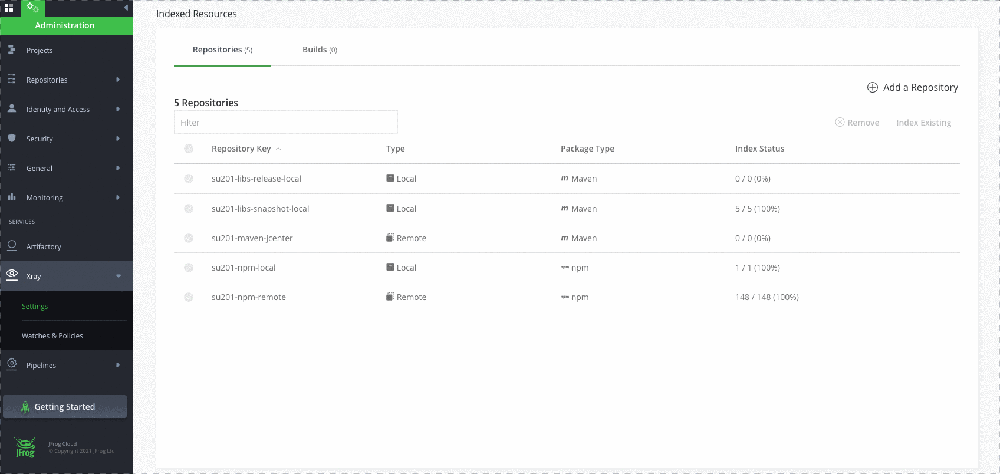
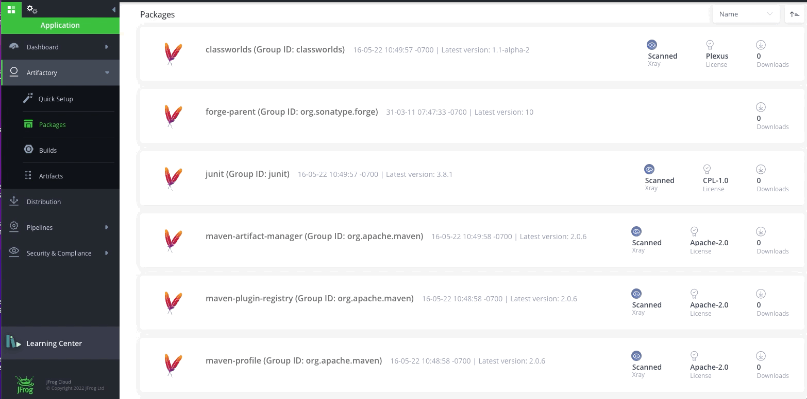
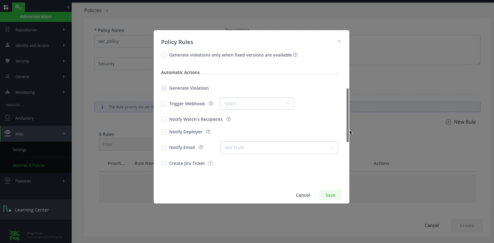
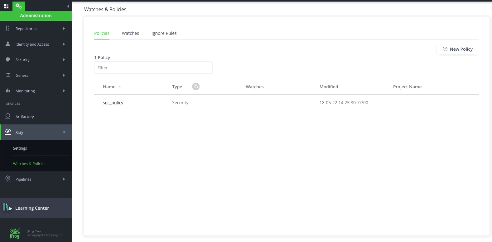
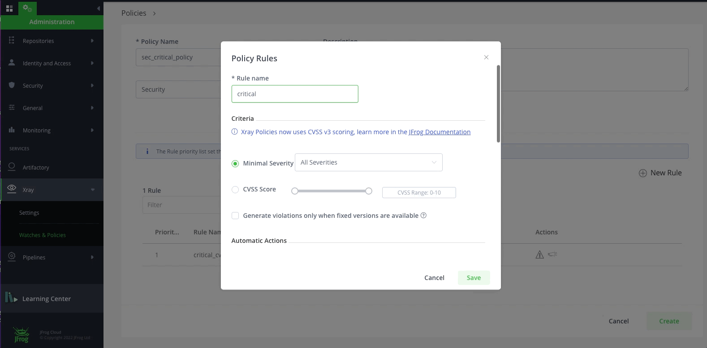

# Lab1 - Get familiar with JFrog Platform and Xray

## Prerequisites
A SAAS Instance of JFrog. This will be provided as part of your enrollment to the Training class.

### Step1 - Add the repositories to the Indexed Resources

- Login to your saas instance **{{instance_name}}**.jfrog.io with  your admin credentials

- Navigate to the **Administration** Module, **Xray** and click on Settings then **Indexed Resources**, now add the **Repositories** that you would like to index.

  
 
- Add **Builds** resources to get indexed
  
  

### Step2 - Create a policy 

- Navigate to the **Administration** Module, expand the **Xray** menu at the bottom and click on **Watches & Policies** menu item. Click on **Create a Policy** and let's create our first **Security** policy called **"sec_policy"**
  
  

- Click on **New Rule** to add rules to **sec_policy**. Add the following rules with **Criteria** and additional **Automatic Actions**. A default Automatic Action of Generate Violation is enabled for every Rule. Click **Save** and Click **Create**.
  * **Rule name**: critical, Criteria: **Minimum Severity**: Critical, Additional Automatic Actions: Notify Deployer
  * **Rule name**: high, Criteria: **Minimum Severity**: High
  * **Rule name**: medium, Criteria: **Minimum Severity**: Medium
  * **Rule name**: low, Criteria: **Minimum Severity**: Low
  
  

- Click on **New Policy**. Let's create a **License** policy with **"lic_policy"** name.
 
  

- Click on **New Rule** to add rule to **lic_policy**. Add two rules with **Criteria** and **Automatic Actions**. Click **Save** and Click **Create**.
  * **Rule name**: allowed_lic_rule, Allowed Licenses: allowed_licenses": "Apache-1.0", "Apache-2.0", "MIT", "BSD", "BSD-1-Clause", "ANTLR-PD"
  * **Rule name**: banned_lic_rule, Banned Licenses: "GPL-1.0", "GPL-2.0", "GPL-3.0", "gnuplot"
  
  

- Click on **New Policy** and create our second **Security** policy called **"sec_critical_policy"**. Add the following Rules to the Policy
  * **Rule name**: critical_cvss, Criteria: **CVSS Range**: 9-10, Additional Automatic Actions: Notify Deployer
  * **Rule name**: critical, Criteria: **Minimum Severity**: Critical
  * **Rule name**: high, Criteria: **Minimum Severity**: High
 
  
  
**NOTE:** You may have noticed that Fields under **Criteria** are different for **License Policy** and for **Security Policy**.  

