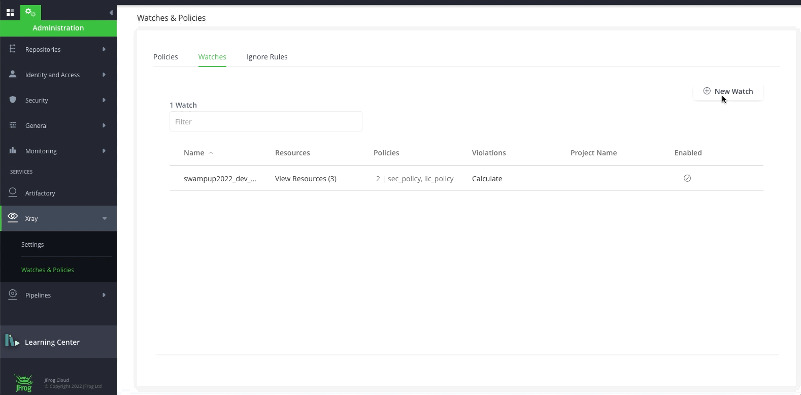

# Lab2 - Create Watch and show violation

## Prerequisites
A SAAS Instance of JFrog. This will be provided as part of your enrollment to the Training class.

### Step 1 - Create Watches

-  Click om the Watch tab and create a new watch name “swampup22_dev_watch”. Add the repositories by clicking on the **Add Repositories** button and add the sec_policy and lic_policy that we just created by clicking on the **Manage Policies** button

   

-  Click om the Watch tab and create a new watch name “swampup22_secops_watch”. Add the repositories by clicking on the **Add Repositories** button and add the sec_critical_policy that we just created by clicking on the **Manage Policies** button

   
   
-  Add the repositories to by clicking on the **Add Repositories** plus button and add the policy that we just created by clicking on the **Manage Policies** button 
   

- Click **Save**.

### Step 2 - Show violations

- Navigate to **Application** > **Security & Compliance** > **Watch Violations**. You will be able to see the watches that we have created in Step 1. Click on the swampup22_dev_watch watch. The Violations tab in a Watch is the central location for viewing the detected violations based on the policies and rules you have predefined on the Watch. You can view the list of the violations, search for violations according to filters, set ignore rules and edit the Watch in the Settings tab.

  

- For **Ignore Violation**, Navigate to **Application** > **Security & Compliance** > **Watch Violation**. Open watch **"swampup-watch"** that we created in STEP 1. 

  