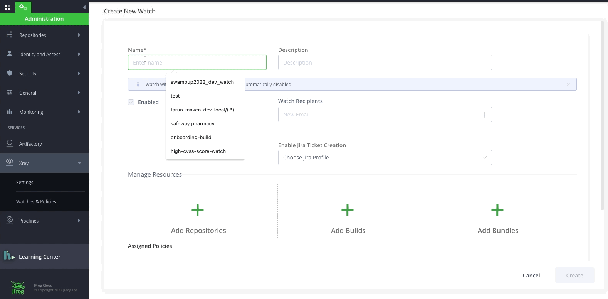
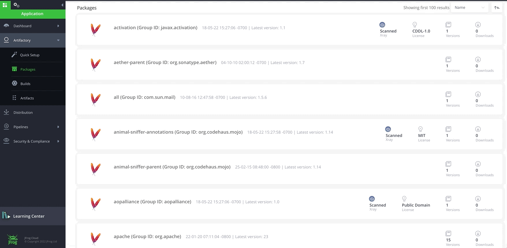
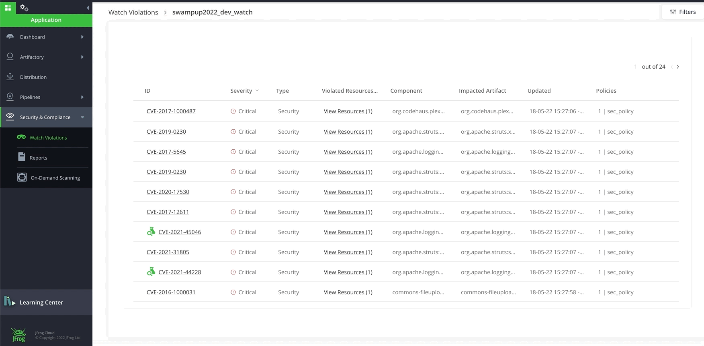

# Lab2 - Create Watch and show violation

## Prerequisites
A SAAS Instance of JFrog. This will be provided as part of your enrollment to the Training class.

### Step 1 - Create Watches

-  Click on the Watch tab and create a new watch name “Prod-Watch”. Under Manage Resources, add the repositories with prefix **s003** by clicking on the **Add Repositories** button and add the two builds swampup22_s003_mvn_pipeline and swampup22_s003_npm_pipeline by clicking on the **Add Builds** button. Add the Prod-Security-Policy and Prod-License-Policy that we just created by clicking on the **Manage Policies** button.

   

### Step 2 - Show violations

- Navigate to **Application** > **Security & Compliance** > **Watch Violations**. You will be able to see the watches that we have created in Step 1. Click on the swampup22_dev_watch watch. The Violations tab in a Watch is the central location for viewing the detected violations based on the policies and rules you have predefined on the Watch. You can view the list of the violations, search for violations according to filters, set ignore rules and edit the Watch in the Settings tab.

  

- For **Ignore Violation**, Navigate to **Application** > **Security & Compliance** > **Watch Violation**. Open watch **"swampup2022_dev_watch"** that we created in STEP 1 and hover your mouse over the right side of a violation. 

  