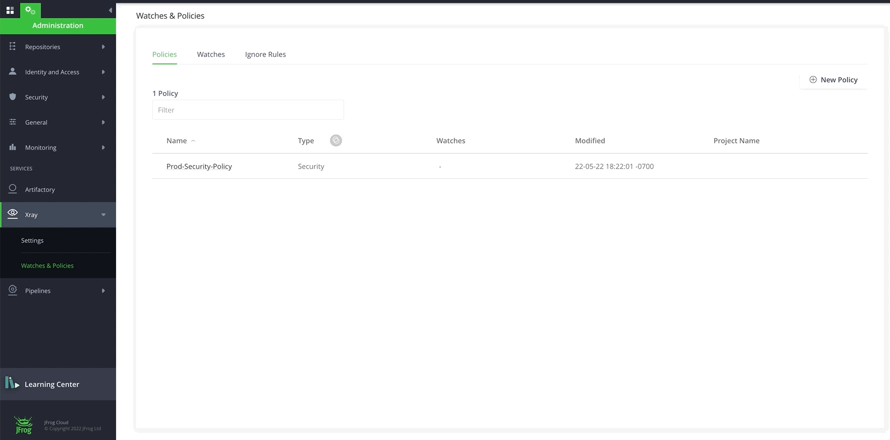

# Lab1 - Get familiar with JFrog Platform and Xray

## Prerequisites
- A SAAS Instance of JFrog Platform. This will be provided as part of your enrollment to the Training class.

 

## INDEX REPOSITORIES using UI

- Login to your saas instance **{{instance_name}}**.jfrog.io with  your admin credentials

- Navigate to the **Administration** Module, **Xray** and click on Settings then **Indexed Resources**

- Add the **Repositories** resources to get indexed

  

 

## INDEX REPOSITORIES using AUTOMATION [Optional]
- Run ``jf xr curl -XPUT /api/v1/binMgr/1/repos -H "Content-Type: application/json" -d @/scripts/index-repos.json``

  

## INDEX BUILDS using UI
- Add **Builds** resources to get indexed
  
  

 

## INDEX BUILDS using AUTOMATION [Optional]
- Run ``jf xr curl -XPUT /api/v1/binMgr/1/builds -H "Content-Type: application/json" -d @/scripts/index-builds.json``

 
 
 

## CREATE POLICIES AND RULES using UI

- Navigate to the **Administration** Module, expand the **Xray** menu at the bottom and click on **Watches & Policies** menu item. 

### CREATE A SECURITY POLICY
- Click on **Create a Policy** and let's create our first **Security** policy called **"prod-security-policy"**
  
  

 

- Click on **New Rule** to add rules to **prod-security-policy**. Add the following rule with **Criteria** and **Automatic Actions**. A default Automatic Action of Generate Violation is enabled for every Rule. Click **Save** and Click **Create**.
  * **Rule name**: high
  * **Criteria**: Minimum Severity: High
  * **Automatic Actions**: 
    * Notify Deployer
    * Block Download 
    * Fail Build
  
  

 

### CREATE A LICENSE POLICY
- Click on **New Policy**. Let's create a **License** policy with **"prod-license-policy"** name.
 
  

 

- Click on **New Rule** to add rule to **prod-license-policy**. Add a Rule for banned licenses with **Criteria** and **Automatic Actions** below. Click **Save** and Click **Create**.
  * **Rule name**: banned
  * **Criteria**: Banned Licenses: "BSD 2-Clause, GPL-3.0"
  * **Automatic Actions**:
    * Notify Deployer
    * Block Download
    * Fail Build
  
  
  
**NOTE:** You may have noticed that Fields under **Criteria** are different for **License Policy** and for **Security Policy**.  

 
 
 

## CREATE POLICIES AND RULES using AUTOMATION [Optional]
### CREATE A SECURITY POLICY
- Run ``jf xr curl -XPOST /api/v2/policies -H 'Content-Type: application/json' -d @/scripts/prod-security-policy.json``
  - With Severity - CRITICAL, HIGH, MEDIUM, LOW with different action items
- Confirm Security Policy named with ``prod-security-policy`` is created

 

### CREATE A LICENSE POLICY
- Run ``jf xr curl -XPOST /api/v2/policies -H 'Content-Type: application/json' -d @/scripts/prod-license-policy.json``
- Confirm License Policy named with ``prod-license-policy`` is created

 
 
 

## CHALLENGE  [Optional]
- Create Policy `Operational Risk` type with Rules 
  - Using UI
  - Using Automation 

