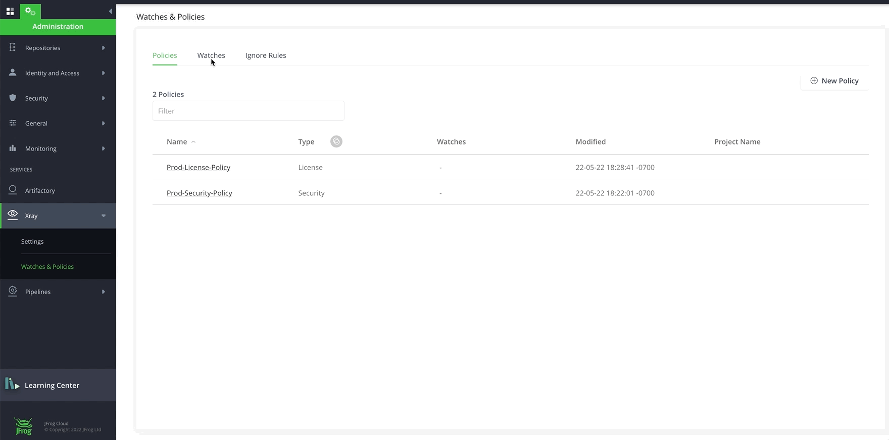

# Lab2 - Create Watch and show violation

## Prerequisites
A SAAS Instance of JFrog. This will be provided as part of your enrollment to the Training class.

### Step 1 - Create Watches

-  Click on the Watch tab and create a new watch name “Prod-Watch”. Under Manage Resources, add the repositories with prefix **s003** by clicking on the **Add Repositories** button and add the two builds swampup22_s003_mvn_pipeline and swampup22_s003_npm_pipeline by clicking on the **Add Builds** button. Add the Prod-Security-Policy and Prod-License-Policy that we just created by clicking on the **Manage Policies** button.

   
