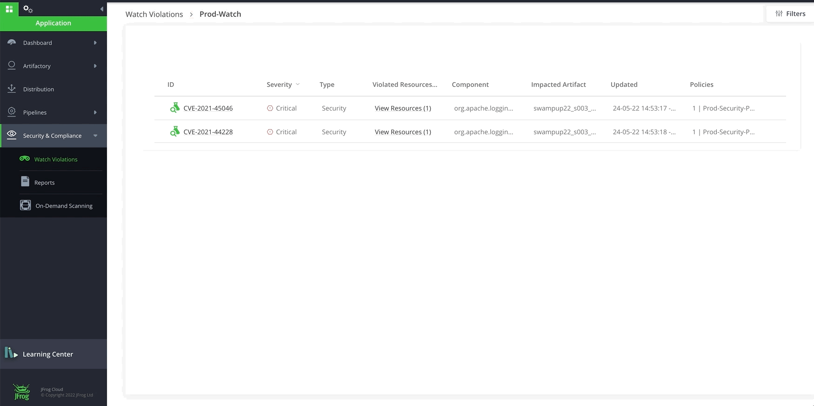

# Lab4 - Xray at CI/CD and Create Reports 
- Prerequisites
- Xray at CI/CD
- Xray Reports (vuln, compliance, SBOM)

## Prerequisites
- A SAAS Instance of JFrog Platform. This will be provided as part of your enrollment to the Training class.
- JFrog CLI is installed on your machine by running `jf -v`

<br/>

## Xray at CI/CD
- One of the Package Manager Integration we can use

#### MAVEN - Package Manager Integration
SUP003-Intro_to_DevSecOps_with_JFrog_Xray/lab-3/project-examples/
- `cd SUP003-Intro_to_DevSecOps_with_JFrog_Xray/lab-4/scripts/project-examples/maven-vulnerable-example`
- To pre-configured with the Artifactory server, repositories and use for building and publishing. The configuration is stored by the command in the .jfrog directory at the root directory of the project.)
  - Run ``jf mvnc``
    - Resolve dependencies from Artifactory? (y/n) [y]? `y`
    - Set Artifactory server ID [SUP016]: ↵
    - Set resolution repository for release dependencies (press Tab for options): `s003-libs-release`
    - Set resolution repository for snapshot dependencies (press Tab for options): `s003-libs-snapshot`
    - Deploy project artifacts to Artifactory? (y/n) [y]? `y`
    - Set Artifactory server ID [SUP016]: ↵
    - Set repository for release artifacts deployment (press Tab for options): `s003-libs-snapshot`
    - Set repository for snapshot artifacts deployment (press Tab for options): `s003-libs-release`
    - Would you like to filter out some of the deployed artifacts? (y/n) [n]? `n`
- Run ``jf mvn clean install -f ./pom.xml --build-name swampup22_s003_mvn_pipeline --build-number $BUILD_NUMBER``

NOTE : We can also ``jf mvnc`` without interactive interface 
  ```
  jf mvnc --repo-resolve-snapshots s003-libs-snapshot --repo-resolve-releases s003-libs-release --repo-deploy-snapshots s003-libs-snapshot --repo-deploy-releases s003-libs-release
  ```

#### NPM - Package Manager Integration
- `cd SUP003-Intro_to_DevSecOps_with_JFrog_Xray/lab-4/scripts/project-examples/npm-vulnerable-example`
- To pre-configured with the Artifactory server, repositories and use for building and publishing. The configuration is stored by the command in the .jfrog directory at the root directory of the project.)
  - Run ``jf npmc``
  - Resolve dependencies from Artifactory? (y/n) [y]? `y`
  - Set Artifactory server ID [SUP016]: ↵
  - Set repository for dependencies resolution (press Tab for options): `s003-npm-virtual`
  - Deploy project artifacts to Artifactory? (y/n) [y]? `y`
  - Set Artifactory server ID [SUP016]: ↵
  - Set repository for artifacts deployment (press Tab for options): `s003-npm-virtual`
- Run ``jf npm install --build-name swampup22_s003_npm_pipeline --build-number $BUILD_NUMBER``
- Run ``jf npm publish --build-name swampup22_s003_npm_pipeline --build-number $BUILD_NUMBER`` - Publish build Artifact to repository

NOTE : We can also ``jf npmc`` without interactive interface
  ```
  jf npmc --repo-resolve s003-npm-virtual --repo-deploy s003-npm-virtual 
  ```

<br />
<br />

### COLLECT ENVIRONMENT VARIABLES
#### Maven
- Run

  ``jf rt build-collect-env swampup22_s003_mvn_pipeline 1.0.0``

  or

  ``jf rt bce swampup22_s003_mvn_pipeline 1.0.0``

#### NPM
- Run ``jf rt bce swampup22_s003_npm_pipeline 1.0.0``

<br />
<br />

### COLLECT INFORMATION REGARDING GIT
#### Maven
- Run

  ``jf rt build-add-git swampup22_s003_mvn_pipeline 1.0.0`` - (.git path[Optional] - Path to a directory containing the .git directory. If not specific, the .git directory is assumed to be in the current directory or in one of the parent directories.)

  or

  ``jf rt bag swampup22_s003_mvn_pipeline 1.0.0``

#### NPM
- Run ``jf rt bag swampup22_s003_npm_pipeline 1.0.0``  - (.git path[Optional] - Path to a directory containing the .git directory. If not specific, the .git directory is assumed to be in the current directory or in one of the parent directories.)

<br />
<br />

### PUBLISH BUILD-INFO
#### Maven publish build-info
- Run ``jf rt bp swampup22_s003_mvn_pipeline 1.0.0``

#### NPM publish build-info
- Run ``jf rt bp swampup22_s003_npm_pipeline 1.0.0``

NOTE: [Command Options](https://www.jfrog.com/confluence/display/CLI/CLI+for+JFrog+Artifactory#CLIforJFrogArtifactory-PublishingBuild-Info)

<br />
<br />

### SCAN BUILD
- Scan a published build-info with Xray using **jf build-scan**
  ```
  jf bs swampup22_s003_mvn_pipeline $BUILD_NUMBER
  ```
  or
  ```
  jf bs swampup22_s003_npm_pipeline $BUILD_NUMBER
  ```
- Additional commands, `--vuln`, `--fail`, `--format`, [more](https://www.jfrog.com/confluence/display/CLI/CLI+for+JFrog+Xray#CLIforJFrogXray-ScanningPublishedBuilds)
- Xray should fail the build with the following raised security violations
  
  | SEVERITY | IMPACTED PACKAGE | IMPACTED PACKAGE VERSION | TYPE  | FIXED VERSIONS | COMPONENT | COMPONENT VERSION | CVE |
  | -------- | ---------------- | ------------------------ | ----- | -------------- | --------  | ----------------- | -------- |
  | 🔥High   | org.apache.logging.log4j:log4j-core | 2.14.1 | Maven | [2.12.2] [2.15.0] [2.3.1] | org.apache.logging.log4j:log4j-core | 2.14.1  | CVE-2021-44228 |
  | 🎃Medium | org.apache.logging.log4j:log4j-core | 2.14.1 | Maven | [2.12.2] [2.16.0] [2.3.1] | org.apache.logging.log4j:log4j-core | 2.14.1  | CVE-2021-45046 |

  | No license compliance violations were found |
  | ----- |

<br />

- See violations in the Artifactory UI. Navigate to **Application** > **Security & Compliance** > **Watch Violations**. You will be able to see the watches that we have created in Step 1. Click on the `prod-watch`. The Violations tab in a Watch is the central location for viewing the detected violations based on the policies and rules you have predefined on the Watch. You can view the list of the violations, search for violations according to filters, set ignore rules and edit the Watch in the Settings tab.

  

- **Ignore Violation** by navigating to **Application** > **Security & Compliance** > **Watch Violation**. Open watch `prod-watch` that we created in STEP 1 and hover your mouse over the right side of a violation.

  

### RESCAN BUILD AFTER UPDATE VERSION OF VULNERABLE DEPENDENCIES 

- Follow the same sequence of steps as above to run a successful build this time.

- This time the build should succeed with the following message


| No security violations were found |
| ----------- |

| No license compliance violations were found |
| -------- |

<br />
<br />
<br />
<br />
<br />

## XRAY REPORTS (VULNERABILITY, COMPLIANCE, SBOM)

### GENERATE VULNERABILITIES REPORT
#### REPORT ON REPOSITORIES using UI
- Navigate to the **Application** > **Security & Compliance** > **Reports**
- Enter `vuln report for repositories` from **Name**
- Select `Vulnerabilities` from  **Report Type**  
- Select `Repositories` from **Scope** 
- Click on `Select Repositories`
- Select &#10004; that is next to Name and Click on a button `>>` to move them to the right
- Click **Save**
  - Review all the options under **Advanced Filters** 

#### REPORT ON REPOSITORIES using Automation
- Run ``jf xr curl -XPOST "/api/v1/reports/vulnerabilities" -H "Content-Type: application/json" -d "@create-vuln-report-on-repositories.json"``
  - We are capturing `Critical` and `High` for today's session
- we will get a response ``{"**report_id**":1,"status":"pending"}``

<br />

#### REPORT ON BUILDS using Automation
- Navigate to the **Application** > **Security & Compliance** > **Reports**
- Enter `vuln report for builds` from **Name**
- Select `Vulnerabilities` from  **Report Type**
- Select `Builds` from **Scope**
- Click on `Select Builds`
- Select &#10004; that is next to Name and Click on a button `>>` to move them to the right
  - NOTE: We also have an option to pick `Only Latest` (By Default) or `# of Last Versions`
- Click **Save**
  - Review all the options under **Advanced Filters**

#### REPORT ON BUILDS using Automation
- Run ``jf xr curl -XPOST "/api/v1/reports/vulnerabilities" -H "Content-Type: application/json" -d "@create-vuln-report-on-builds.json"``
  - we will get a response ``{"**report_id**":2,"status":"pending"}``

<br />


### GET VULNERABILITIES REPORT CONTENT using Automation
- Get the ``{{**report_id**}}`` number from above and replace
  - Run ``jf xr curl -XPOST '/api/v1/reports/vulnerabilities/{{**report_id**}}?direction=asc&page_num=1&num_of_rows=10&order_by=summary'``

<br />
<br />

### GENERATE VULNERABILITIES REPORT
#### GENERATE LICENSE DUE DILIGENCE REPORT on REPOSITORIES using UI
- Navigate to the **Application** > **Security & Compliance** > **Reports**
- Enter `license report for repositories` from **Name**
- Select `License Due Diligence` from  **Report Type**
- Select `Repositories` from **Scope**
- Click on `Select Repositories`
- Select &#10004; that is next to Name and Click on a button `>>` to move them to the right
- Click **Save**
  - Review all the options under **Advanced Filters**

#### GENERATE LICENSE DUE DILIGENCE REPORT ON REPOSITORIES using Automation
- Run ``jf xr curl -XPOST /api/v1/reports/licenses -H 'Content-Type: application/json' -d @create-license-report-on-repositories.json``

#### GENERATE LICENSE DUE DILIGENCE REPORT on BUILDS using UI
- Navigate to the **Application** > **Security & Compliance** > **Reports**
- Enter `license report for builds` from **Name**
- Select `License Due Diligence` from  **Report Type**
- Select `Builds` from **Scope**
- Click on `Select Builds`
- Select &#10004; that is next to Name and Click on a button `>>` to move them to the right
- Click **Save**
  - Review all the options under **Advanced Filters**

<br />

#### GET VULNERABILITIES REPORT CONTENT using Automation
- Get the ``{{**report_id**}}`` number from above and replace
  - Run ``jf xr curl -XPOST '/api/v1/reports/licenses/{{**report_id**}}?direction=asc&page_num=1&num_of_rows=10&order_by=component'``

<br />
<br />

### GENERATE VIOLATIONS REPORT
#### GET VIOLATIONS REPORT on REPOSITORIES using UI
- Navigate to the **Application** > **Security & Compliance** > **Reports**
- Enter `violations report for repositories` from **Name**
- Select `Violations` from  **Report Type**
- Select `Repositories` from **Scope**
- Click on `Select Repositories`
- Select &#10004; that is next to Name and Click on a button `>>` to move them to the right
- Click **Save**
  - Review all the options under **Advanced Filters**

#### GET VIOLATIONS REPORT on BUILDS using UI
- Navigate to the **Application** > **Security & Compliance** > **Reports**
- Enter `violations report for builds` from **Name**
- Select `Violations` from  **Report Type**
- Select `Builds` from **Scope**
- Click on `Select Builds`
- Select &#10004; that is next to Name and Click on a button `>>` to move them to the right
- Click **Save**
  - Review all the options under **Advanced Filters**

#### GET VIOLATIONS REPORT on REPOSITORIES using Automation
- Run ``jf xr curl -XPOST /api/v1/reports/violations -H 'Content-Type: application/json' -d @create-violations-report-on-repositories.json``

<br />
<br />

### GENERATE OPERATIONAL RISK REPORT
#### GET OPERATIONAL RISK on REPOSITORIES using UI
- Navigate to the **Application** > **Security & Compliance** > **Reports**
- Enter `os report for repositories` from **Name**
- Select `Operational Risk` from  **Report Type**
- Select `Repositories` from **Scope**
- Click on `Select Repositories`
- Select &#10004; that is next to Name and Click on a button `>>` to move them to the right
- Click **Save**
  - Review all the options under **Advanced Filters**

#### GET OPERATIONAL RISK on BUILDS using UI
- Navigate to the **Application** > **Security & Compliance** > **Reports**
- Enter `os report for builds` from **Name**
- Select `Operational Risk` from  **Report Type**
- Select `Builds` from **Scope**
- Click on `Select Builds`
- Select &#10004; that is next to Name and Click on a button `>>` to move them to the right
- Click **Save**
  - Review all the options under **Advanced Filters**

<br />
<br />

### GENERATE SBOM REPORT IN SPDX OR CYCLONEDX
- Copy the SHA256 value of an Artifact that we have in our instance.
  - Example - In UI, navigate to  ``Application >> Artifactory >> Artifacts >> jfrog-npm-main-local >> frogui >> frogsui-0.3.0-11.tgz``
- Update the SHA256 value in ``create-SBOM-spdx-report.json``
- Run ``jf xr curl -XPOST /api/v1/component/exportDetails -H 'Content-Type: application/json' -d @create-SBOM-spdx-report.json >> report.zip``
  - Run ``ls -la`` and unzip ``report.zip``
  - open `*.json` file
  ```json
  {
    "component_name": "",
    "package_type": "npm",
    "sha_256" : "98467fa038d58d65780938a2e2c73904302300b4e96d3209f2a6b397ec3889ec",
  
    # For SPDX report
    "spdx": true,
    "spdx_format": "json"     # json | tag:value | xlsx,
    
    # For CYCLONEDX report
    "cyclonedx": true,
    "cyclonedx_format": "json"      # json | xml
  }
  ```

<br />
<br />

## SAMPLE CI PIPELINES [Optional - MUST for POST SESSION]
- Example Projects `cd ci-example`
  - JFrog CLI help with creating [sample yml](https://github.com/MaharshiPatel/SwampUp2022/tree/main/SUP016-Automate_everything_with_the_JFrog_CLI/lab-3#setting-up-a-ci-pipeline-optional---must-for-post-session) file
- [More Examples](https://github.com/jfrog/project-examples)

<br />
<br />
<br />

## CHALLENGE [Optional]
- Get Complete Dependency Graph for a build
- Find Component by CVE HINT: [searchByCves](https://www.jfrog.com/confluence/display/JFROG/Xray+REST+API#XrayRESTAPI-FindComponentbyCVE)
  - Log4J - [CVE-2021-44228](https://jfrog.com/blog/your-log4shell-remediation-cookbook-using-the-jfrog-platform/)
    - HINT: Refer to ``create-vuln-report-on-repositories.json`` or ``search-all-components-by-cve.json``
  - Spring4Shell - [CVE-2022-22965](https://jfrog.com/blog/springshell-zero-day-vulnerability-all-you-need-to-know/)
  - xmlhttprequest-ssl - CVE-2020-28502
- Generate `cyclonedx` SBOM report in `JSON` format
- Generate License Due Diligence on Builds using Automation
- Generate Operational Risk using Automation  

