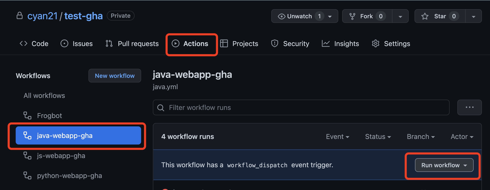

# Instructions

1. fork this github repository :<>
2. clone on your local machine the github repository
3. execute in a (linux) terminal

```bash
cd init
chmod +x init.sh
# run the script and pass parameters (don't forget the single quotes !)
./init.sh 'https://yann.jfrog.io' 'yannc@jfrog.com' '********' 'jfrog-platform-training'
```

4. save the result of the command as you'll need it later
5. log on your github account and go to your forked repository
6. run your workflow and pass the parameters the requested information

