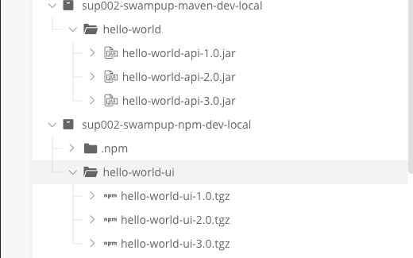

### Welcome to Swampup2022-SUP-002-Distribution

### Source code

- Open Github repository https://github.com/jfrog/SwampUp2022 in a browser
- Navigate to sup002-distribution folder

```bash
https://github.com/jfrog/SwampUp2022/blob/main/sup002-distribution/
```

#### Requirements

- SaaS JFrog Platform instance
- Clone/Download the [git repo](https://github.com/jfrog/SwampUp2022) 
- Command prompt - Windows or Linux with cURL installed (cURL should be installed by default on terminal( Linux/mac) and using powershell(windows))
- Jfrog CLI installed ( check the below section for setting up CLI ) 
- Set up API keys (Click on username on right top -> Edit user profile ->Enter password -> generate API Key and save it. Follow this [doc](https://www.jfrog.com/confluence/display/JFROG/User+Profile#UserProfile-APIKey) for more details ) 

#### Set up Jfrog CLI 

- Check this [link](https://jfrog.com/getcli/) , if you need more ways to install cli other than the ones mentioned below 
- Run the below command to install cli on Linux/Mac

  ```curl -fL https://install-cli.jfrog.io | sh```
  
- Run the below command to install on windows 
   - Open the powershell and run the below command 
   
   ``` powershell "Start-Process -Wait -Verb RunAs powershell '-NoProfile iwr https://releases.jfrog.io/artifactory/jfrog-cli/v2-jf/[RELEASE]/jfrog-cli-windows-amd64/jf.exe -OutFile $env:SYSTEMROOT\system32\jf.exe'" ```
  
- Once the Jfrog CLI is successfully downloaded , open the terminal and start configuring CLI to integrate with your instance 

- Run the below command and follow the prompt
      `jf config add`
      
      - Choose a server ID  <Give an id  Example - atlanta-jpd-platform>
      - JFrog platform URL  < Your instance name  Example atl-prd.jfrog.io>
      - Select save and continue 
      - JFrog access token <Leave blank for username and password/API key>
      - JFrog username <Same username used to login to the instance>
      - JFrog password or API key <Password or API key https://www.jfrog.com/confluence/display/JFROG/User+Profile#UserProfile-APIKey . API key is recommended>

#### Environment ready check 

- Login to your saas instance <instance_name>.jfrog.io with your admin credentials
- Click on Artifacts on the left hand side menu 
- Make sure below repositories and its content are created as shown in the image 
  
      - sup002-swampup-maven-dev-local
  
      - sup002-swampup-npm-dev-local
  
  

- If the above data is not present on the instance , go to the Swampup2022 git repo and run the below scripts to generate the data (windows users may have issues running the below scripts . Need to contact the crew in that case)

```
  cd SwampUp2022/sup002-distribution/scripts/setup 
  sh setup.sh <username of the artifactory instance> <password> <instance URL>
  eg : sh setup.sh "test@jfrog.com" "test123" "https://test.jfrog.io/artifactory" 
 ```
   
- Once the above step is successful , make sure the data is present as mentioned the above 
- Make sure the JPD platform has Edge nodes added to the instance and are Online . Go to settings menu -> Platform Management -> Registered JPDs to validate

#### Documentation on Distribution 

https://www.jfrog.com/confluence/display/JFROG/JFrog+Distribution


