# SUP-002 Distribution 


## Goal 
Goal of this lab to is to create a release bundle and distribute the release bundle version 1.0 to the available edge nodes and validate using the Jfrog UI 

### Prerequisites 


### Distribution 
  
- Go to Distribution Menu -> Release Bundles on the left side menu 
  
  
    
 -  Create a Release bundle 
  
   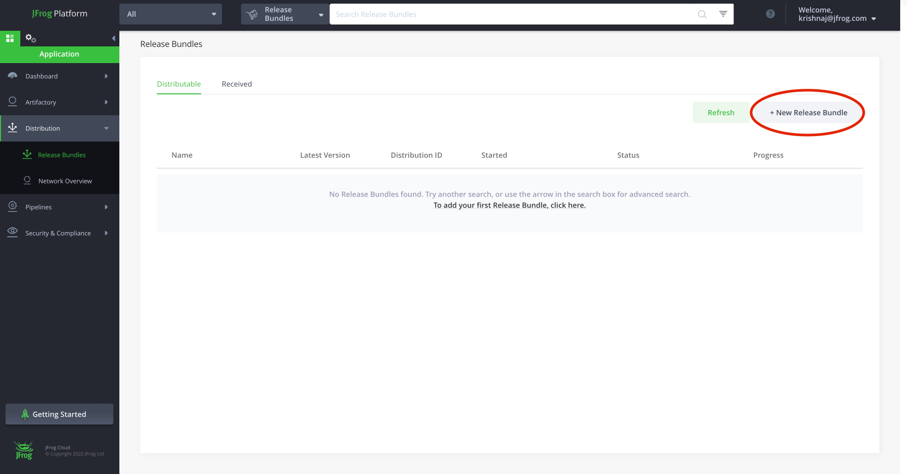 

- Enter Name,Version and Description as shown and click Add AQL Query 

   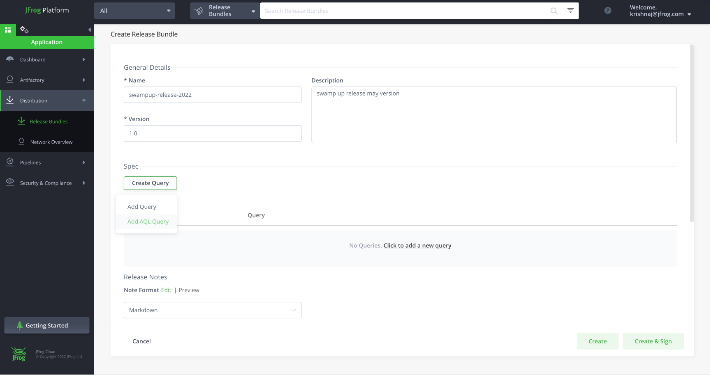

- Paste the below AQL Query and click Next . AQL Query fetches the required artifacts needed to be added to the bundle 

   ```
   items.find({
	"$and": [
		{
			"$or": [
				{
					"repo": {
						"$eq": "sup002-swampup-maven-dev-local"
					}
				},
				{
					"repo": {
						"$eq": "sup002-swampup-npm-dev-local"
					}
				}
			]
		},
		{
			"$or": [
				{
					"name": {
						"$match": "hello-world-api-1.0.jar"
					}
				},
				{
					"name": {
						"$match": "hello-world-ui-1.0.tgz"
					}
				}
			]
		}
	]}).include("sha256","updated","modified_by","created","id","original_md5","depth","actual_sha1","property.value","modified","property.key","actual_md5","created_by","type","name","repo","original_sha1","size","path")
   ```
   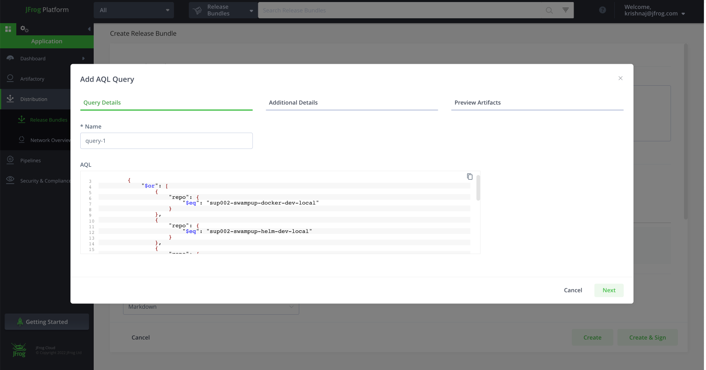
    
- Add the following key value pair and click NExt 
   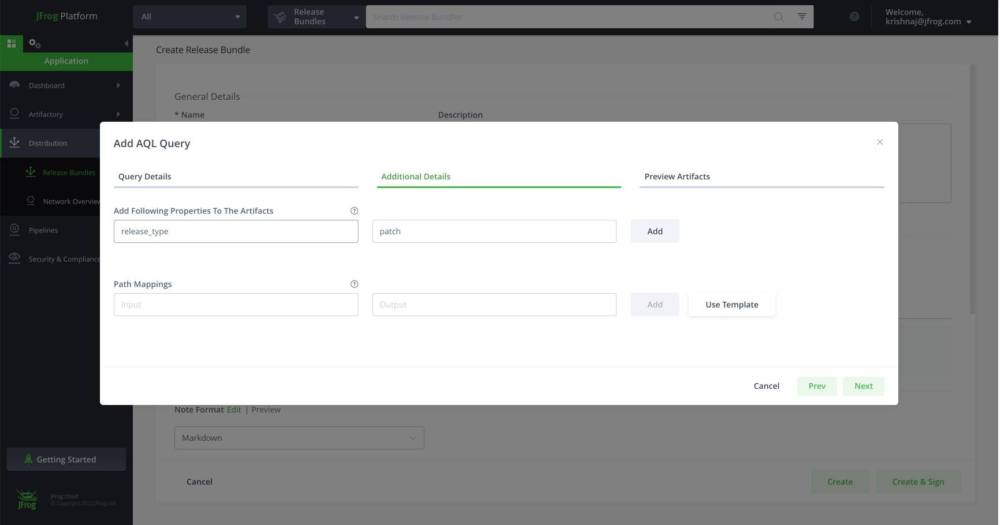

- Preview all the artifacts that AQL query collected and validate 
  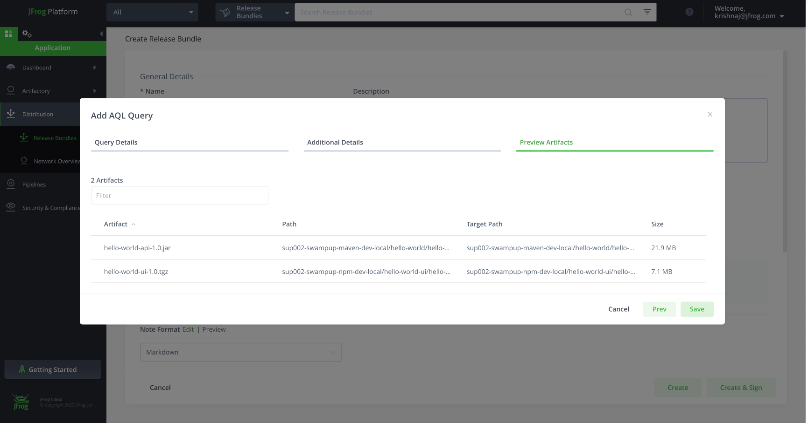

- Click on create and sign 
  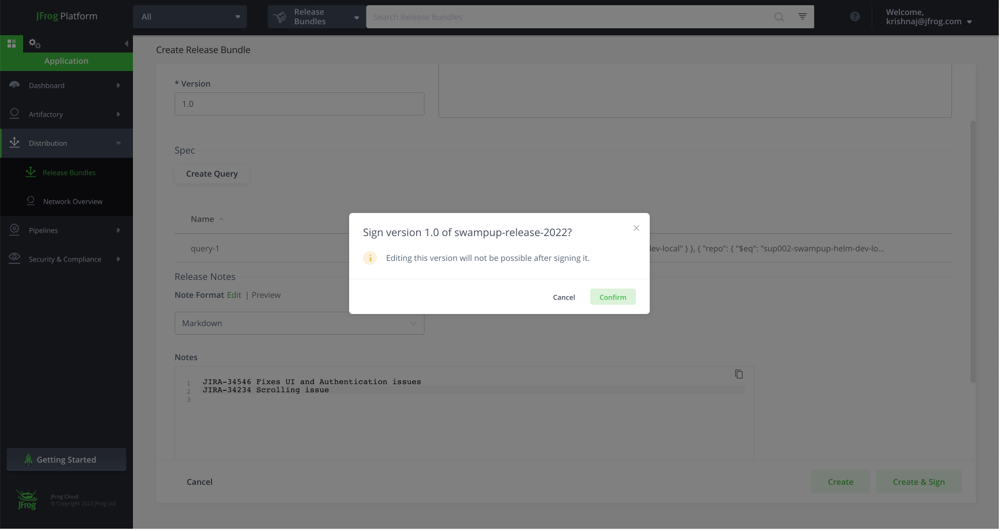

- Verify if release bundle is created 
    

- Click on Distribute Release Bundle 
   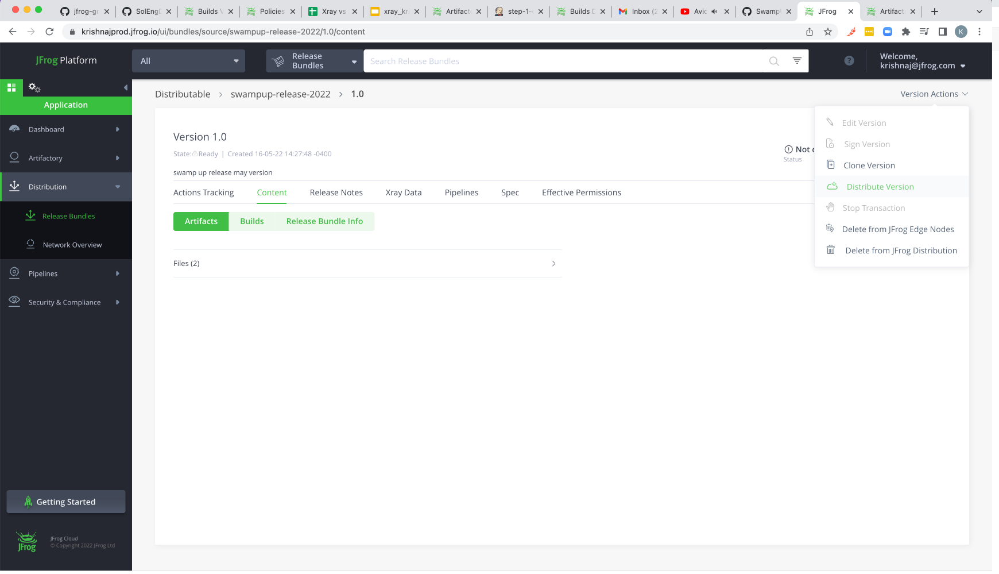

- select all the edge nodes and make Target Repository Auto-creation check box is enabled 
  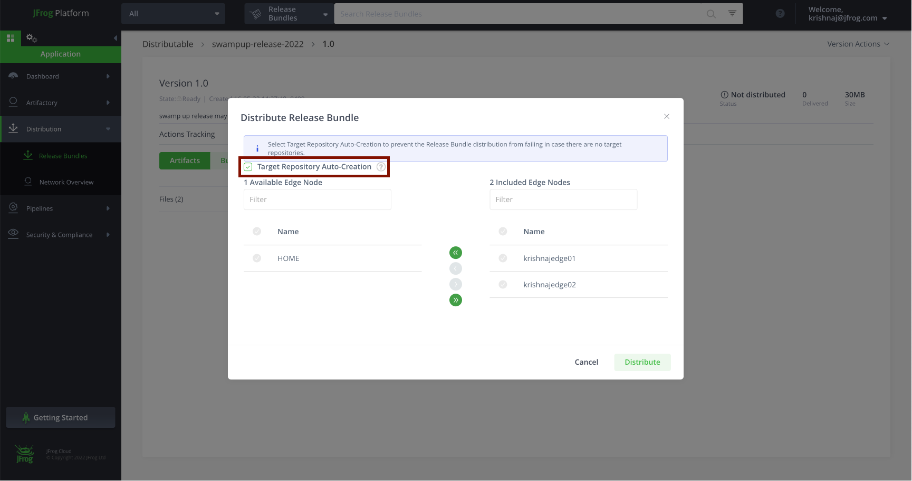
    
- Distrubute 
  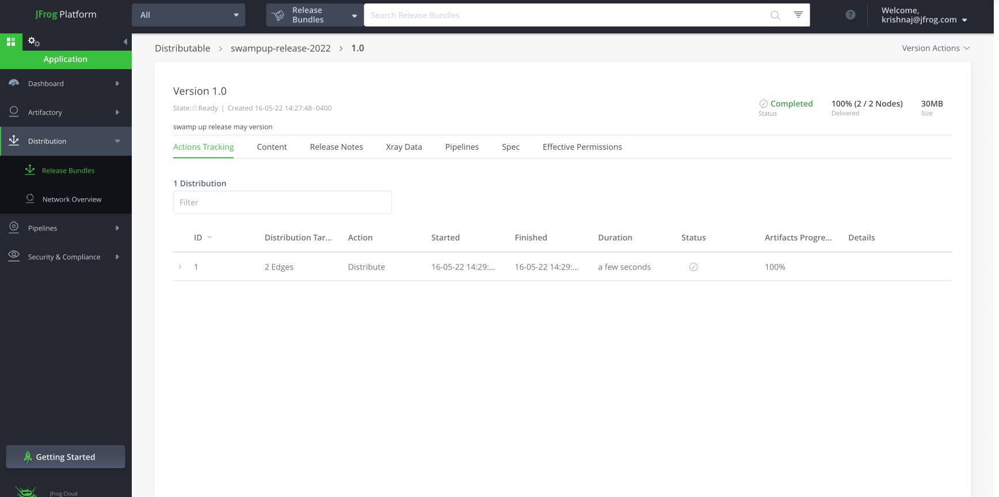
    
- validate the release bundle is distributed 
  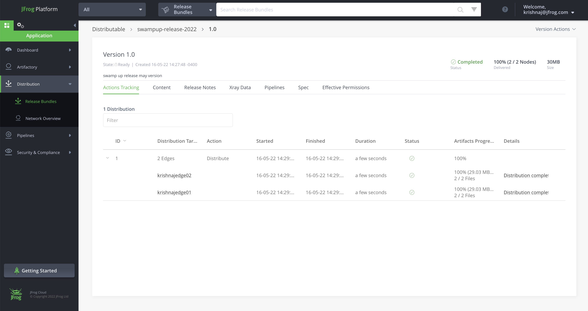
    
- click on release bundle to see it is distributed to edge nodes
  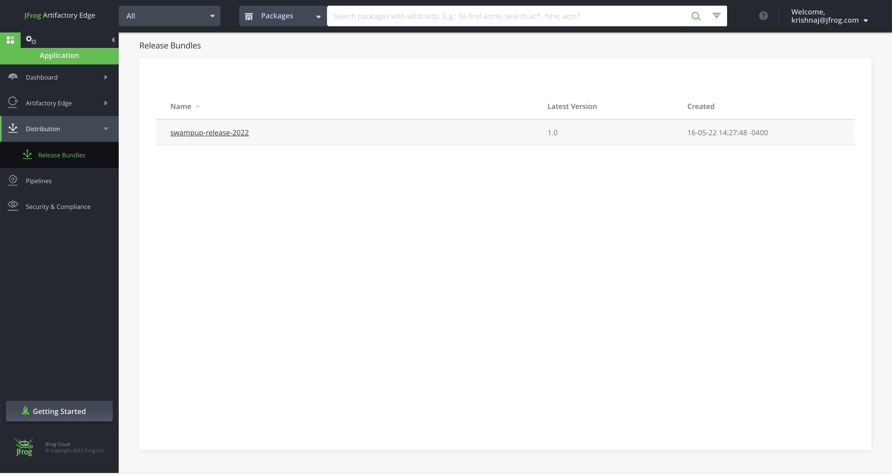


